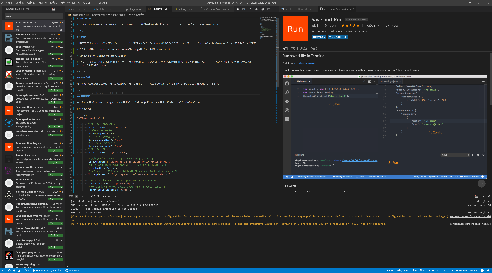

# DTO Maker

これはあなたの拡張機能 "dtomaker"のためのREADMEです。簡単な説明を書き終えたら、次のセクションを含めることをお勧めします。

<br />

## 特徴

実際のエクステンションのスクリーンショットなど、エクステンションの特定の機能について説明してください。イメージパスはこのREADMEファイルを基準にしています。



> ヒント：多くの一般的な拡張機能はアニメーションを利用します。これはあなたの拡張機能を披露するための優れた方法です！従うことが簡単で、焦点を絞った短いアニメーションをお勧めします。

<br />

## 必要条件

要件や依存関係がある場合は、それらを説明し、それらをインストールおよび構成する方法を説明したセクションを追加してください。

<br />

## 拡張設定

あなたの拡張がcontrib.configuration拡張ポイントを通して任意のVS Code設定を追加するかどうか含めてください。

For example:

``` json
"DTOMaker.configs": [
    {
        // データベースのホスト
        "database.host": "192.168.1.100",
        // データベースのポート
        "database.port": 3306,
        // データベースのユーザー名
        "database.user": "root",
        // データベースのパスワード
        "database.password": "pass",
        // データベース名
        "database.databse": "system_name",

        // 出力先のパス [default "${workspaceRoot}\\output"]
        "io.outputPath": "${workspaceRoot}\\classes\\IO\\DataBase\\DTO",
        // DTO生成前に出力先フォルダの中身をすべて削除する [default true]
        "io.outputReset": true,
        // テンプレートファイルのパス [default "${workspaceRoot}\\template.txt"]
        "io.templatePath": "${workspaceRoot}\\.vscode\\dto-template.txt",

        // DTOクラス名のPrefix・Suffix [default "${className}DTO"]
        "format.className": "${className}DTO",
        // テーブル名からマッチした先頭文字を取り外す [default "table_"]
        "format.ltrimTableName": "table_",
    }
]
```

### 置き換え文字

出力先フォルダやテンプレートファイルの場所を指定する際の置き換え文字。

|置き換え文字|説明|
|---|---|
|`${workspaceRoot}`|ワークスペースルートフォルダ|
|`${workspaceFolder}`|VS Codeで開かれたフォルダのパス|
|`${className}`|DTOクラス・ファイル名|

<br />

## 既知の問題点

既知の問題を指摘することで、内線番号に対して重複する問題を開くユーザーを制限することができます。

<br />

## リリースノート

エクステンションをアップデートするにつれて、ユーザはリリースノートに感謝します。

### 1.0.0

初期リリース
